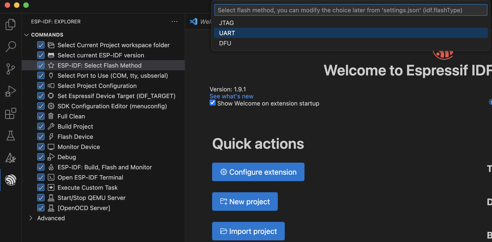
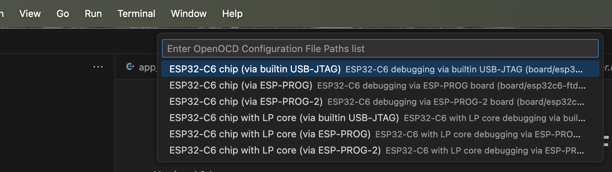
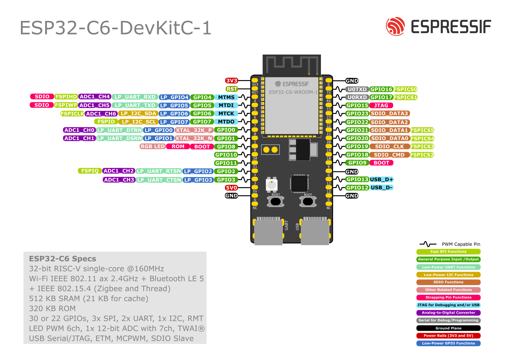

# Building a Matter over Thread Accessory Device based on the Espressif ESP32-C6-DEVKITC-1-N8 Dev Kit board
### Author: [Olav Tollefsen](https://www.linkedin.com/in/olavtollefsen/)

## Introduction

This article shows how to build a Matter Air Quality sensor with an ESP32-C6-DEVKITC-1-N8 Dev Kit board and a Sensirion SEN66 air quality sensor. The Sensirion SEN66 sensor connects to the ESP32 using I2C and supports measuring Particulate Matter (PM1, PM2.5, PM4, PM10), Relative Humidity, Temperature, Volatile Organic Compound, NOx (nitrogen oxides) and CO2.


### What you will need

- A Mac computer as the development workstation
- Espressif ESP32-C6-DEVKITC-1-N8 Dev Kit board
- Sensirion SEN66 air quality sensor

## Install prerequisites

Before installing the Espressif development tools some prerequsites needs to be installed on MacOS.

### Homebrew package manager

If you haven't already installed the Homebrew package manager, you can install it by following the instructions found on the Homebrew web site https://brew.sh.

When you install Homebrew, it prints some directions for updating your shell’s config. If you don’t follow those directions, Homebrew will not work.

### Python

Espressif ESP-IDF uses the version of Python installed by default on macOS.

You can check what version of Python you have installed by issuing this command:

```
python3 --version
```

### Install packages

```
brew install cmake ninja dfu-util
```

### Install Visual Studio Code

Visit https://code.visualstudio.com/download and follow the instructions to download and install Visual Studio Code.

### Install ESP-IDF

The documentation for the ESP-IDF Extension for Visual Studio Code can be found here:

https://docs.espressif.com/projects/vscode-esp-idf-extension/en/latest/

Click on the Extensions icon in Visual Studio Code and search for "Espressif". Select the "ESP-IDF" extension and install it.


After installing the ESP-IDF extension you need to configure it.

Select "Configure ESP-IDF Extension":


Select the Express Setup Mode


Select version of ESP-IDF that is recommended here https://github.com/espressif/esp-matter and click "Install":


### Install ESP-Matter

Note! Make sure you have an folder open in Visual Studio Code before installing ESP-Matter. Otherwise the installation will fail with an error about a missing workspace.

Select the Espressif ESP-IDF extension in the Visual Studio Code menu, expand the Advanced section and select "Install ESP-Matter":


Select the default options.

## Create a new project based on the light example

Click on "Show examples".


Select the ESP-Matter Framework.


Click on the "light" example in the list of example applications.


Click "Select location for creating light project":


## Select Flash Method



## Select Port To Use


## Set Expressif Device Target


## Configure OpenOCD (for debugging)

Select this menu choice from Visual Studio Code:

View->Command Palette

Select the "ESP-IDF: Select OpenOCD Board Configuration":



Note! To use the JTAG debugging connect the USB-C cable to the right USB-port on the ESP32-C6 dev kit.

## Change settings from WiFi to Thread

Note! You don't need to create this file if you base your project on the "light" example, since it's already created for you.

Create a new text file named "sdkconfig.defaults.c6_thread"

Add the following content:

```
CONFIG_IDF_TARGET="esp32c6"

# libsodium
CONFIG_LIBSODIUM_USE_MBEDTLS_SHA=y

# NIMBLE
CONFIG_BT_ENABLED=y
CONFIG_BT_NIMBLE_ENABLED=y
CONFIG_BT_NIMBLE_EXT_ADV=n
CONFIG_BT_NIMBLE_HCI_EVT_BUF_SIZE=70
CONFIG_USE_BLE_ONLY_FOR_COMMISSIONING=n

# Enable OpenThread
CONFIG_OPENTHREAD_ENABLED=y
CONFIG_OPENTHREAD_SRP_CLIENT=y
CONFIG_OPENTHREAD_DNS_CLIENT=y
CONFIG_OPENTHREAD_LOG_LEVEL_DYNAMIC=n
CONFIG_OPENTHREAD_LOG_LEVEL_NOTE=y
CONFIG_OPENTHREAD_CLI=n

# Disable lwip ipv6 autoconfig
CONFIG_LWIP_IPV6_AUTOCONFIG=n

# LwIP config for OpenThread
CONFIG_LWIP_IPV6_NUM_ADDRESSES=8
CONFIG_LWIP_MULTICAST_PING=y

# MDNS platform
CONFIG_USE_MINIMAL_MDNS=n
CONFIG_ENABLE_EXTENDED_DISCOVERY=y

# Disable STA for ESP32C6
CONFIG_ENABLE_WIFI_STATION=n

# Enable HKDF in mbedtls
CONFIG_MBEDTLS_HKDF_C=y
```


```
CONFIG_ESPTOOLPY_FLASHSIZE_4MB=y
```

```
idf.py -D SDKCONFIG_DEFAULTS="sdkconfig.defaults.c6_thread" set-target esp32c6
```

## Add Thread Networking Diagnostics Cluster

Add this function to "app_main.cpp":

```
void AddThreadNetworkDiagnosticsCluster(node_t* node)
{
    endpoint_t* root_endpoint = endpoint::get(node, 0);

    cluster::thread_network_diagnostics::config_t thread_network_config;
    cluster::thread_network_diagnostics::create(root_endpoint, &thread_network_config, CLUSTER_FLAG_SERVER);
}
```

Add a call to it below the code that creates the Node.

You should place it in a section that is only active when Thread is enabled as shown below:

```
#if CHIP_DEVICE_CONFIG_ENABLE_THREAD
...
    AddThreadNetworkDiagnosticsCluster(node);
#endif
```

## Connect the hardware


The recommended voltage is 3.3V.



## Connecting the SEN66 sensor

- Connecting the SEN66 air quality sensor

| ESP32-C6 Pin | SEN66 Pin |
|--------------|-----------|
| GND          | GND       |
| 3V3          | VCC       |
| GPIO 6       | SDA       |
| GPIO 7       | SCL       |

## Add configuration for the SEN66 I2C pin configuration

Create a new text file named "Kconfig.projbuild" under the "main" directory.

Add the following content:

```
menu "SEN66 I2C Configuration"

    config SEN66_I2C_SDA_PIN
        int "I2C SDA Pin"
        default 6
        help
            GPIO number for I2C master data

    config SEN66_I2C_SCL_PIN
        int "I2C SCL Pin"
        default 7
        help
            GPIO number for I2C master clock

endmenu
```

Save the file.

The values can now be edited with by using the Kconfig editor:

```
idf.py menuconfig
```

## Copy SEN66 I2C driver source files into your project

You will find I2C driver source files in this Github repo:

https://github.com/Sensirion/embedded-i2c-sen66

Create a new directory under "main" named "drivers".

Update the "CMakeLists.txt" file (in the "main" directory) to include the "drivers" subdirectory like this:

```
idf_component_register(SRC_DIRS          "." "drivers"
                       PRIV_INCLUDE_DIRS  "." "drivers" "${ESP_MATTER_PATH}/examples/common/utils")
```

Copy the .h and .c source files to your projects main/drivers directory.

Replace the content of the sensirion_i2c_hal.c source file with this code:

```cpp
#include "sensirion_i2c_hal.h"
#include "sensirion_common.h"
#include "sensirion_config.h"

#include <esp_log.h>
#include "driver/i2c_master.h"
#include "sdkconfig.h"

/*
 * INSTRUCTIONS
 * ============
 *
 * Implement all functions where they are marked as IMPLEMENT.
 * Follow the function specification in the comments.
 */

 static const char * TAG = "SEN66";

#define I2C_MASTER_SCL_IO CONFIG_SEN66_I2C_SCL_PIN
#define I2C_MASTER_SDA_IO CONFIG_SEN66_I2C_SDA_PIN
#define I2C_MASTER_NUM I2C_NUM_0    /*!< I2C port number for master dev */
#define I2C_MASTER_FREQ_HZ 100000   /*!< I2C master clock frequency */

i2c_master_bus_handle_t bus_handle;
i2c_master_dev_handle_t dev_handle = NULL;

i2c_master_dev_handle_t sensirion_i2c_hal_add_device(uint8_t address)
{
    i2c_device_config_t dev_cfg = {
        .dev_addr_length = I2C_ADDR_BIT_LEN_7,
        .device_address = address,
        .scl_speed_hz = 100000,
    };

    i2c_master_dev_handle_t dev_handle;
    ESP_ERROR_CHECK(i2c_master_bus_add_device(bus_handle, &dev_cfg, &dev_handle));

    return dev_handle;
}

/**
 * Select the current i2c bus by index.
 * All following i2c operations will be directed at that bus.
 *
 * THE IMPLEMENTATION IS OPTIONAL ON SINGLE-BUS SETUPS (all sensors on the same
 * bus)
 *
 * @param bus_idx   Bus index to select
 * @returns         0 on success, an error code otherwise
 */
int16_t sensirion_i2c_hal_select_bus(uint8_t bus_idx) {
    /* TODO:IMPLEMENT or leave empty if all sensors are located on one single
     * bus
     */
    return NOT_IMPLEMENTED_ERROR;
}

/**
 * Initialize all hard- and software components that are needed for the I2C
 * communication.
 */
void sensirion_i2c_hal_init(void)
{
    i2c_master_bus_config_t i2c_mst_config = {
        .clk_source = I2C_CLK_SRC_DEFAULT,
        .i2c_port = I2C_MASTER_NUM,
        .scl_io_num = I2C_MASTER_SCL_IO,
        .sda_io_num = I2C_MASTER_SDA_IO,
        .glitch_ignore_cnt = 7,
        .flags.enable_internal_pullup = true,
    };

    ESP_ERROR_CHECK(i2c_new_master_bus(&i2c_mst_config, &bus_handle));

    ESP_LOGI(TAG, "sensirion_i2c_hal_init:  i2c_new_master_bus completed.");

    return;
}

/**
 * Release all resources initialized by sensirion_i2c_hal_init().
 */
void sensirion_i2c_hal_free(void) {
    /* TODO:IMPLEMENT or leave empty if no resources need to be freed */
}

/**
 * Execute one read transaction on the I2C bus, reading a given number of bytes.
 * If the device does not acknowledge the read command, an error shall be
 * returned.
 *
 * @param address 7-bit I2C address to read from
 * @param data    pointer to the buffer where the data is to be stored
 * @param count   number of bytes to read from I2C and store in the buffer
 * @returns 0 on success, error code otherwise
 */
int8_t sensirion_i2c_hal_read(uint8_t address, uint8_t* data, uint8_t count)
{
    if (dev_handle == NULL)
        dev_handle = sensirion_i2c_hal_add_device(address);

    esp_err_t status = i2c_master_receive(dev_handle, data, count, -1);
    ESP_ERROR_CHECK(status);

    return status;
}

/**
 * Execute one write transaction on the I2C bus, sending a given number of
 * bytes. The bytes in the supplied buffer must be sent to the given address. If
 * the slave device does not acknowledge any of the bytes, an error shall be
 * returned.
 *
 * @param address 7-bit I2C address to write to
 * @param data    pointer to the buffer containing the data to write
 * @param count   number of bytes to read from the buffer and send over I2C
 * @returns 0 on success, error code otherwise
 */
int8_t sensirion_i2c_hal_write(uint8_t address, const uint8_t* data, uint8_t count)
{
    if (dev_handle == NULL)
        dev_handle = sensirion_i2c_hal_add_device(address);

    esp_err_t status = i2c_master_transmit(dev_handle, data, count, -1);
    ESP_ERROR_CHECK(status);

    return status;
}

/**
 * Sleep for a given number of microseconds. The function should delay the
 * execution for at least the given time, but may also sleep longer.
 *
 * Despite the unit, a <10 millisecond precision is sufficient.
 *
 * @param useconds the sleep time in microseconds
 */
void sensirion_i2c_hal_sleep_usec(uint32_t useconds) {
    esp_rom_delay_us(useconds);
}
```

## Add a class for the Sensirion SEN66 Sensor

Create a new "SensirionSEN66.h" file in the "main" folder with the following code:

```cpp
#include <stdint.h>

class SensirionSEN66
{
public:

  class MeasuredValues
  {
  public:

    uint16_t ParticulateMatter1p0 = 0;
    uint16_t ParticulateMatter2p5 = 0;
    uint16_t ParticulateMatter4p0 = 0;
    uint16_t ParticulateMatter10p0 = 0;
    int16_t AmbientHumidity = 0;
    int16_t AmbientTemperature = 0;
    int16_t VOCIndex = 0;
    int16_t NOxIndex = 0;
    uint16_t CO2 = 0;
  };

  void Init();

  int16_t ReadMeasuredValues(MeasuredValues* measuredValues);

  int16_t SetSensorAltitude(uint16_t altitude);

  int16_t StartContiniousMeasurement();

};
```

Create a new "SensirionSEN66.cpp" file with the following code:

```cpp
#include "SensirionSEN66.h"
#include "drivers/sen66_i2c.h"
#include "drivers/sensirion_common.h"
#include "drivers/sensirion_i2c_hal.h"

void SensirionSEN66::Init()
{
  sensirion_i2c_hal_init();
  sen66_init(SEN66_I2C_ADDR_6B);
}

int16_t SensirionSEN66::ReadMeasuredValues(MeasuredValues* measuredValues)
{
  int16_t status = sen66_read_measured_values_as_integers(
    &measuredValues->ParticulateMatter1p0,
    &measuredValues->ParticulateMatter2p5,
    &measuredValues->ParticulateMatter4p0,
    &measuredValues->ParticulateMatter10p0,
    &measuredValues->AmbientHumidity,
    &measuredValues->AmbientTemperature,
    &measuredValues->VOCIndex,
    &measuredValues->NOxIndex,
    &measuredValues->CO2);

    return status;
}

int16_t SensirionSEN66::SetSensorAltitude(uint16_t altitude)
{
  int16_t status = sen66_set_sensor_altitude(altitude);
  return status;
}

int16_t SensirionSEN66::StartContiniousMeasurement()
{
  int16_t status = sen66_start_continuous_measurement();

  return status;
}
```

## Add Code for Matter Air Quaility Sensor Clusters

Create a new "MatterAirQuality.h" file in the "main" folder with the following code:

```cpp
#pragma once

#include <esp_matter.h>

#include "SensirionSEN66.h"

using namespace esp_matter;
using namespace esp_matter::endpoint;
using namespace chip::app::Clusters::AirQuality;

class MatterAirQuality
{
    public:

        MatterAirQuality(endpoint_t* lightEndpoint);

        void CreateAirQualityEndpoint(node_t* node);
        
        void StartMeasurements();

    private:

        endpoint_t* m_lightEndpoint;
        endpoint_t* m_airQualityEndpoint;
        SensirionSEN66 m_sensirionSEN66;
        esp_timer_handle_t m_timer_handle;

        void AddRelativeHumidityMeasurementCluster();

        void AddTemperatureMeasurementCluster();

        void AddCarbonDioxideConcentrationMeasurementCluster();

        void AddPm1ConcentrationMeasurementCluster();

        void AddPm25ConcentrationMeasurementCluster();

        void AddPm10ConcentrationMeasurementCluster();

        void AddNitrogenDioxideConcentrationMeasurementCluster();

        void AddTotalVolatileOrganicCompoundsConcentrationMeasurementCluster();

        void AddAirQualityClusterFeatures();

        static void MeasureAirQualityTimerCallback(void *arg);

        static void SetLightOnOff(endpoint_t* lightEndpoint, bool on);

        static void SetLightLevelPercent(endpoint_t* lightEndpoint, float levelPercent);

        static void SetLightColorHSV(endpoint_t* lightEndpoint, uint8_t hue, uint8_t saturation);

        static void SetLightByAirQuality(endpoint_t* lightEndpoint, AirQualityEnum airQuality);

        static AirQualityEnum ClassifyAirQuality(SensirionSEN66::MeasuredValues* measuredValues);

        static void UpdateAirQualityAttributes(
            endpoint_t* airQualityEndpoint,
            endpoint_t* lightEndpoint,
            SensirionSEN66::MeasuredValues* measuredValues);

};
```

Create a new "MatterAirQuality.cpp" file in the "main" folder with the following code:

```cpp
#include "MatterAirQuality.h"

#include <esp_err.h>
#include <esp_log.h>
#include <common_macros.h>
#include <math.h>

#include "sensirion_common.h"

using namespace esp_matter::attribute;
using namespace chip::app::Clusters;

static const char *TAG = "MatterAirQuality";

MatterAirQuality::MatterAirQuality(endpoint_t* lightEndpoint)
{
    m_lightEndpoint = lightEndpoint;
}

void MatterAirQuality::CreateAirQualityEndpoint(node_t* node)
{
    // Create Air Quality Endpoint
    air_quality_sensor::config_t air_quality_config;
    m_airQualityEndpoint = air_quality_sensor::create(node, &air_quality_config, ENDPOINT_FLAG_NONE, NULL);
    ABORT_APP_ON_FAILURE(m_airQualityEndpoint != nullptr, ESP_LOGE(TAG, "Failed to create air quality sensor endpoint"));

    AddAirQualityClusterFeatures();

    // Add Concentration Measurement Clusters
    AddRelativeHumidityMeasurementCluster();
    AddTemperatureMeasurementCluster();
    AddCarbonDioxideConcentrationMeasurementCluster();
    AddPm1ConcentrationMeasurementCluster();
    AddPm25ConcentrationMeasurementCluster();
    AddPm10ConcentrationMeasurementCluster();
    AddNitrogenDioxideConcentrationMeasurementCluster();
    AddTotalVolatileOrganicCompoundsConcentrationMeasurementCluster();

    // Initialize Air Quality Sensor
    m_sensirionSEN66.Init();
    m_sensirionSEN66.SetSensorAltitude(25);
}

void MatterAirQuality::StartMeasurements()
{
    SetLightOnOff(m_lightEndpoint, false);
    SetLightColorHSV(m_lightEndpoint, 0, 0);
    SetLightLevelPercent(m_lightEndpoint, 0.0);

    int16_t status = m_sensirionSEN66.StartContiniousMeasurement();
    ABORT_APP_ON_FAILURE(status == NO_ERROR, ESP_LOGE(TAG, "SEN66 StartContiniousMeasurement failed."));

        // Setup periodic timer to measure air quality

        esp_timer_create_args_t timer_args = {
            .callback = &MeasureAirQualityTimerCallback,
            .arg = this,
            .dispatch_method = ESP_TIMER_TASK, // Run callback in a task (safer for I2C)
            .name = "measure_air_quality_timer",
            .skip_unhandled_events = true, // Skip if previous callback is still running
        };
    
        esp_err_t err = esp_timer_create(&timer_args, &m_timer_handle);
        if (err != ESP_OK) {
            ESP_LOGE(TAG, "Failed to create timer: %s", esp_err_to_name(err));
            return;
        }
    
        // Start the timer to trigger every 60 seconds (1 minute)
        err = esp_timer_start_periodic(m_timer_handle, 60 * 1000000ULL); // 60 seconds in microseconds
        if (err != ESP_OK) {
            ESP_LOGE(TAG, "Failed to start timer: %s", esp_err_to_name(err));
        }
        ESP_LOGI(TAG, "Air quality timer started");
}

void static UpdateAttributeValueBool(endpoint_t* endpoint, uint32_t cluster_id, uint32_t attribute_id, bool value)
{
    uint16_t endpoint_id = esp_matter::endpoint::get_id(endpoint);

    esp_matter_attr_val_t val = esp_matter_bool(value);

    esp_matter::attribute::update(endpoint_id, cluster_id, attribute_id, &val);
}

void static UpdateAttributeValueUInt8(endpoint_t* endpoint, uint32_t cluster_id, uint32_t attribute_id, uint8_t value)
{
    uint16_t endpoint_id = esp_matter::endpoint::get_id(endpoint);

    esp_matter_attr_val_t val = esp_matter_uint8(value);

    esp_matter::attribute::update(endpoint_id, cluster_id, attribute_id, &val);
}

static void UpdateAttributeValueInt16(endpoint_t* endpoint, uint32_t cluster_id, uint32_t attribute_id, int16_t value)
{
    uint16_t endpoint_id = esp_matter::endpoint::get_id(endpoint);

    esp_matter_attr_val_t val = esp_matter_int16(value);

    esp_matter::attribute::update(endpoint_id, cluster_id, attribute_id, &val);
}

static void UpdateAttributeValueFloat(endpoint_t* endpoint, uint32_t cluster_id, uint32_t attribute_id, float value)
{
    uint16_t endpoint_id = esp_matter::endpoint::get_id(endpoint);

    esp_matter_attr_val_t val = esp_matter_float(value);

    esp_matter::attribute::update(endpoint_id, cluster_id, attribute_id, &val);
}

void MatterAirQuality::AddRelativeHumidityMeasurementCluster()
{
    esp_matter::cluster::relative_humidity_measurement::config_t relative_humidity_config;
    esp_matter::cluster::relative_humidity_measurement::create(m_airQualityEndpoint, &relative_humidity_config, CLUSTER_FLAG_SERVER);
}

void MatterAirQuality::AddTemperatureMeasurementCluster()
{
    // Add TemperatureMeasurement cluster
    cluster::temperature_measurement::config_t temperature_measurement;
    cluster::temperature_measurement::create(m_airQualityEndpoint, &temperature_measurement, CLUSTER_FLAG_SERVER);
}

void MatterAirQuality::AddCarbonDioxideConcentrationMeasurementCluster()
{
    cluster::carbon_dioxide_concentration_measurement::config_t co2_measurement;
    cluster_t* cluster = esp_matter::cluster::carbon_dioxide_concentration_measurement::create(m_airQualityEndpoint, &co2_measurement, CLUSTER_FLAG_SERVER);
    
    // Add the NumericMeasurement (MEA) Feature flag    
    cluster::carbon_dioxide_concentration_measurement::feature::numeric_measurement::config_t numeric_measurement_config;
    cluster::carbon_dioxide_concentration_measurement::feature::numeric_measurement::add(cluster, &numeric_measurement_config);

    // Set the MeasurementUnit to PPM
    UpdateAttributeValueUInt8(
        m_airQualityEndpoint,
        CarbonDioxideConcentrationMeasurement::Id,
        CarbonDioxideConcentrationMeasurement::Attributes::MeasurementUnit::Id,
        static_cast<int16_t>(CarbonDioxideConcentrationMeasurement::MeasurementUnitEnum::kPpm));

    // Set the MeasurementMedium to Air
    UpdateAttributeValueUInt8(
        m_airQualityEndpoint,
        CarbonDioxideConcentrationMeasurement::Id,
        CarbonDioxideConcentrationMeasurement::Attributes::MeasurementMedium::Id,
        static_cast<int16_t>(CarbonDioxideConcentrationMeasurement::MeasurementMediumEnum::kAir));
}

void MatterAirQuality::AddPm1ConcentrationMeasurementCluster()
{
    esp_matter::cluster::pm1_concentration_measurement::config_t pm1_measurement;
    cluster_t* cluster = esp_matter::cluster::pm1_concentration_measurement::create(m_airQualityEndpoint, &pm1_measurement, CLUSTER_FLAG_SERVER);

    // Add the NumericMeasurement (MEA) Feature flag    
    cluster::pm1_concentration_measurement::feature::numeric_measurement::config_t numeric_measurement_config;
    cluster::pm1_concentration_measurement::feature::numeric_measurement::add(cluster, &numeric_measurement_config);

    // Set the MeasurementUnit to Microgram per m3
    UpdateAttributeValueUInt8(
        m_airQualityEndpoint,
        Pm1ConcentrationMeasurement::Id,
        Pm1ConcentrationMeasurement::Attributes::MeasurementUnit::Id,
        static_cast<int16_t>(Pm1ConcentrationMeasurement::MeasurementUnitEnum::kUgm3));

    // Set the MeasurementMedium to Air
    UpdateAttributeValueUInt8(
        m_airQualityEndpoint,
        Pm1ConcentrationMeasurement::Id,
        Pm1ConcentrationMeasurement::Attributes::MeasurementMedium::Id,
        static_cast<int16_t>(Pm1ConcentrationMeasurement::MeasurementMediumEnum::kAir));
}

void MatterAirQuality::AddPm25ConcentrationMeasurementCluster()
{
    esp_matter::cluster::pm25_concentration_measurement::config_t pm25_measurement;
    cluster_t* cluster = esp_matter::cluster::pm25_concentration_measurement::create(m_airQualityEndpoint, &pm25_measurement, CLUSTER_FLAG_SERVER);

    // Add the NumericMeasurement (MEA) Feature flag
    cluster::pm25_concentration_measurement::feature::numeric_measurement::config_t numeric_measurement_config;
    cluster::pm25_concentration_measurement::feature::numeric_measurement::add(cluster, &numeric_measurement_config);

    // Set the MeasurementUnit to Microgram per m3
    UpdateAttributeValueUInt8(
        m_airQualityEndpoint,
        Pm25ConcentrationMeasurement::Id,
        Pm25ConcentrationMeasurement::Attributes::MeasurementUnit::Id,
        static_cast<int16_t>(Pm25ConcentrationMeasurement::MeasurementUnitEnum::kUgm3));

    // Set the MeasurementMedium to Air
    UpdateAttributeValueUInt8(
        m_airQualityEndpoint,
        Pm25ConcentrationMeasurement::Id,
        Pm25ConcentrationMeasurement::Attributes::MeasurementMedium::Id,
        static_cast<int16_t>(Pm25ConcentrationMeasurement::MeasurementMediumEnum::kAir));    
}

void MatterAirQuality::AddPm10ConcentrationMeasurementCluster()
{
    esp_matter::cluster::pm10_concentration_measurement::config_t pm10_measurement;
    cluster_t* cluster = esp_matter::cluster::pm10_concentration_measurement::create(m_airQualityEndpoint, &pm10_measurement, CLUSTER_FLAG_SERVER);

    // Add the NumericMeasurement (MEA) Feature flag
    cluster::pm10_concentration_measurement::feature::numeric_measurement::config_t numeric_measurement_config;
    cluster::pm10_concentration_measurement::feature::numeric_measurement::add(cluster, &numeric_measurement_config);

    // Set the MeasurementUnit to Microgram per m3
    UpdateAttributeValueUInt8(
        m_airQualityEndpoint,
        Pm10ConcentrationMeasurement::Id,
        Pm10ConcentrationMeasurement::Attributes::MeasurementUnit::Id,
        static_cast<int16_t>(Pm10ConcentrationMeasurement::MeasurementUnitEnum::kUgm3));

    // Set the MeasurementMedium to Air
    UpdateAttributeValueUInt8(
        m_airQualityEndpoint,
        Pm10ConcentrationMeasurement::Id,
        Pm10ConcentrationMeasurement::Attributes::MeasurementMedium::Id,
        static_cast<int16_t>(Pm10ConcentrationMeasurement::MeasurementMediumEnum::kAir));    
}

void MatterAirQuality::AddNitrogenDioxideConcentrationMeasurementCluster()
{
    esp_matter::cluster::nitrogen_dioxide_concentration_measurement::config_t nox_measurement;
    cluster_t* cluster = esp_matter::cluster::nitrogen_dioxide_concentration_measurement::create(m_airQualityEndpoint, &nox_measurement, CLUSTER_FLAG_SERVER);

    // Add the NumericMeasurement (MEA) Feature flag
    cluster::nitrogen_dioxide_concentration_measurement::feature::numeric_measurement::config_t numeric_measurement_config;
    cluster::nitrogen_dioxide_concentration_measurement::feature::numeric_measurement::add(cluster, &numeric_measurement_config);

    // Set the MeasurementUnit to PPM
    UpdateAttributeValueUInt8(
        m_airQualityEndpoint,
        NitrogenDioxideConcentrationMeasurement::Id,
        NitrogenDioxideConcentrationMeasurement::Attributes::MeasurementUnit::Id,
        static_cast<int16_t>(NitrogenDioxideConcentrationMeasurement::MeasurementUnitEnum::kPpm));

    // Set the MeasurementMedium to Air
    UpdateAttributeValueUInt8(
        m_airQualityEndpoint,
        NitrogenDioxideConcentrationMeasurement::Id,
        NitrogenDioxideConcentrationMeasurement::Attributes::MeasurementMedium::Id,
        static_cast<int16_t>(NitrogenDioxideConcentrationMeasurement::MeasurementMediumEnum::kAir));    
}

void MatterAirQuality::AddTotalVolatileOrganicCompoundsConcentrationMeasurementCluster()
{
    esp_matter::cluster::total_volatile_organic_compounds_concentration_measurement::config_t voc_measurement;
    cluster_t* cluster = esp_matter::cluster::total_volatile_organic_compounds_concentration_measurement::create(m_airQualityEndpoint, &voc_measurement, CLUSTER_FLAG_SERVER);

    // Add the NumericMeasurement (MEA) Feature flag
    cluster::total_volatile_organic_compounds_concentration_measurement::feature::numeric_measurement::config_t numeric_measurement_config;
    cluster::total_volatile_organic_compounds_concentration_measurement::feature::numeric_measurement::add(cluster, &numeric_measurement_config);

    // Set the MeasurementUnit to PPM
    UpdateAttributeValueUInt8(
        m_airQualityEndpoint,
        TotalVolatileOrganicCompoundsConcentrationMeasurement::Id,
        TotalVolatileOrganicCompoundsConcentrationMeasurement::Attributes::MeasurementUnit::Id,
        static_cast<int16_t>(TotalVolatileOrganicCompoundsConcentrationMeasurement::MeasurementUnitEnum::kPpm));

    // Set the MeasurementMedium to Air
    UpdateAttributeValueUInt8(
        m_airQualityEndpoint,
        TotalVolatileOrganicCompoundsConcentrationMeasurement::Id,
        TotalVolatileOrganicCompoundsConcentrationMeasurement::Attributes::MeasurementMedium::Id,
        static_cast<int16_t>(TotalVolatileOrganicCompoundsConcentrationMeasurement::MeasurementMediumEnum::kAir));
}

void MatterAirQuality::AddAirQualityClusterFeatures()
{
    cluster_t *cluster = cluster::get(m_airQualityEndpoint, AirQuality::Id);

    /* Add additional features to the Air Quality cluster */
    cluster::air_quality::feature::fair::add(cluster);
    //cluster::air_quality::feature::mod::add(cluster);
    //cluster::air_quality::feature::vpoor::add(cluster);
    //cluster::air_quality::feature::xpoor::add(cluster);
}

void MatterAirQuality::SetLightOnOff(endpoint_t* lightEndpoint, bool on)
{
    UpdateAttributeValueBool(
        lightEndpoint,
        OnOff::Id,
        OnOff::Attributes::OnOff::Id,
        on);
}

void MatterAirQuality::SetLightLevelPercent(endpoint_t* lightEndpoint, float levelPercent)
{
    uint8_t level = (uint8_t)((levelPercent / 100) * 256 + 0.5);

    UpdateAttributeValueUInt8(
        lightEndpoint,
        LevelControl::Id,
        LevelControl::Attributes::CurrentLevel::Id,
        level);    
}

void MatterAirQuality::SetLightColorHSV(endpoint_t* lightEndpoint, uint8_t hue, uint8_t saturation)
{
    // Hue represents the color. It ranges from 0 to 360 degrees.
    // 0 degrees = Red
    // 120 degrees = Green
    // 240 degrees = Blue
    // In matter it's representet as a byte with the range 0 to 255.

    ESP_LOGI(TAG, "SetLightColorHSV: CurrentHue=%d CurrentSaturation=%d" , hue, saturation); 

    UpdateAttributeValueUInt8(
        lightEndpoint,
        ColorControl::Id,
        ColorControl::Attributes::CurrentHue::Id,
        hue);

    UpdateAttributeValueUInt8(
        lightEndpoint,
        ColorControl::Id,
        ColorControl::Attributes::CurrentSaturation::Id,
        saturation);    
}

static uint8_t HueDegreesToUInt8(float degrees)
{
    // Wrap degrees to 0-360 using modulo
    float wrapped = fmodf(degrees, 360.0f);

    // Scale to 0-256 and round
    float scaled = (wrapped / 360.0f) * 256.0f;

    // Cast to uint8_t, letting 256 overflow to 0
    return (uint8_t)(scaled + 0.5f);    
}

void MatterAirQuality::SetLightByAirQuality(endpoint_t* lightEndpoint, AirQualityEnum airQuality)
{
    uint8_t saturation = 254; // Full saturation for vivid colors. Note! 255 is reserved and should not be used.
    uint8_t hue = 0;
    float level = 0.0;

    switch (airQuality) {
        case AirQuality::AirQualityEnum::kGood:
            hue = HueDegreesToUInt8(120.0); // Green
            level = 10.0;
            break;
        case AirQuality::AirQualityEnum::kFair:
            hue = HueDegreesToUInt8(100.0); // Green-yellow
            level = 10.0;
            break;
        case AirQuality::AirQualityEnum::kModerate:
            hue = HueDegreesToUInt8(80.0);  // Yellow-green (~80°)
            level = 15.0;
            break;
        case AirQuality::AirQualityEnum::kPoor:
            hue = HueDegreesToUInt8(60.0);  // Yellow
            level = 15.0;
            break;
        case AirQuality::AirQualityEnum::kVeryPoor:
            hue = HueDegreesToUInt8(30.0);  // Orange
            level = 20.0;
            break;
        case AirQuality::AirQualityEnum::kExtremelyPoor:
            hue = HueDegreesToUInt8(0.0);   // Red
            level = 30.0;
            break;
        case AirQuality::AirQualityEnum::kUnknown:
            hue = 0;     // Neutral (could also reduce saturation)
            level = 0.0; // Off
            break;
        default:
            ESP_LOGE(TAG, "Unknown air quality enum value");
            return;
    }
    
    SetLightOnOff(lightEndpoint, true);
    SetLightColorHSV(lightEndpoint, hue, saturation);
    SetLightLevelPercent(lightEndpoint, level);   
}

AirQualityEnum MatterAirQuality::ClassifyAirQuality(SensirionSEN66::MeasuredValues* measuredValues)
{
    uint16_t co2Value = measuredValues->CO2;

    if (co2Value < 380)
        return AirQuality::AirQualityEnum::kUnknown;
    else if (co2Value < 500)
        return AirQualityEnum::kGood;
    else if (co2Value < 700)
        return AirQualityEnum::kFair;
    else if (co2Value < 800)
        return AirQualityEnum::kModerate;
    else if (co2Value < 900)
        return AirQualityEnum::kPoor;
    else if (co2Value < 1000)
        return AirQualityEnum::kVeryPoor;
    else
        return AirQualityEnum::kExtremelyPoor;
}

void MatterAirQuality::UpdateAirQualityAttributes(
    endpoint_t* airQualityEndpoint,
    endpoint_t* lightEndpoint,
    SensirionSEN66::MeasuredValues* measuredValues)
{
    // Update the Air Quality clusters

    if (measuredValues->AmbientHumidity != 0x7FFF)
        UpdateAttributeValueInt16(
            airQualityEndpoint,
            RelativeHumidityMeasurement::Id,
            RelativeHumidityMeasurement::Attributes::MeasuredValue::Id,
            measuredValues->AmbientHumidity);

    if (measuredValues->AmbientTemperature != 0x7FFF)
        UpdateAttributeValueInt16(
            airQualityEndpoint,
            TemperatureMeasurement::Id,
            TemperatureMeasurement::Attributes::MeasuredValue::Id,
            measuredValues->AmbientTemperature / 2);

    if (measuredValues->CO2 != 0xFFFF)
        UpdateAttributeValueFloat(
            airQualityEndpoint,
            CarbonDioxideConcentrationMeasurement::Id,
            CarbonDioxideConcentrationMeasurement::Attributes::MeasuredValue::Id,
            measuredValues->CO2);

    if (measuredValues->ParticulateMatter1p0 != 0xFFFF)
        UpdateAttributeValueFloat(
            airQualityEndpoint,
            Pm1ConcentrationMeasurement::Id,
            Pm1ConcentrationMeasurement::Attributes::MeasuredValue::Id,
            measuredValues->ParticulateMatter1p0 / 10);

    if (measuredValues->ParticulateMatter2p5 != 0xFFFF)
        UpdateAttributeValueFloat(
            airQualityEndpoint,
            Pm25ConcentrationMeasurement::Id,
            Pm25ConcentrationMeasurement::Attributes::MeasuredValue::Id,
            measuredValues->ParticulateMatter2p5 / 10);

    if (measuredValues->ParticulateMatter10p0 != 0xFFFF)
        UpdateAttributeValueFloat(
            airQualityEndpoint,
            Pm10ConcentrationMeasurement::Id,
            Pm10ConcentrationMeasurement::Attributes::MeasuredValue::Id,
            measuredValues->ParticulateMatter10p0 / 10);

    if (measuredValues->VOCIndex != 0x7FFF)
        UpdateAttributeValueFloat(
            airQualityEndpoint,
            TotalVolatileOrganicCompoundsConcentrationMeasurement::Id,
            TotalVolatileOrganicCompoundsConcentrationMeasurement::Attributes::MeasuredValue::Id,
            measuredValues->VOCIndex / 10);

    if (measuredValues->NOxIndex != 0x7FFF)
        UpdateAttributeValueFloat(
            airQualityEndpoint,
            NitrogenDioxideConcentrationMeasurement::Id,
            NitrogenDioxideConcentrationMeasurement::Attributes::MeasuredValue::Id,
            measuredValues->NOxIndex / 10);

    AirQualityEnum airQuality = ClassifyAirQuality(measuredValues);
    
    UpdateAttributeValueInt16(
        airQualityEndpoint,
        AirQuality::Id,
        AirQuality::Attributes::AirQuality::Id,
        static_cast<int16_t>(airQuality));

    SetLightByAirQuality(lightEndpoint, airQuality);
}

// Timer callback to measure air quality
void MatterAirQuality::MeasureAirQualityTimerCallback(void *arg)
{
    MatterAirQuality* airQuality = static_cast<MatterAirQuality*>(arg);

    SensirionSEN66* sensor = &airQuality->m_sensirionSEN66;

    SensirionSEN66::MeasuredValues* measuredValues = new SensirionSEN66::MeasuredValues();

    int16_t status = sensor->ReadMeasuredValues(measuredValues);

    ESP_LOGI(TAG, "MeasureAirQualityTimerCallback: temperature=%d", measuredValues->AmbientTemperature);
    ESP_LOGI(TAG, "MeasureAirQualityTimerCallback: co2=%d", measuredValues->CO2);

    // Need to use ScheduleLambda to execute the updates to the clusters on the Matter thread for thread safety
    chip::DeviceLayer::SystemLayer().ScheduleLambda(
        [
            airQualityEndpoint = airQuality->m_airQualityEndpoint,
            lightEndpoint = airQuality->m_lightEndpoint,
            measuredValues
        ]
        {
            UpdateAirQualityAttributes(airQualityEndpoint, lightEndpoint, measuredValues);
            delete measuredValues;           
        }
    );
}
```

## Add Code to use Matter Air Quality

Add this include file to "app_main.cpp":

```cpp
#include "MatterAirQuality.h"
```

Declare the variable:

```
MatterAirQuality* matterAirQuality;
```

Add this code to "app_main.cpp" after the endpoints in the existing code have been added:

```
    matterAirQuality = new MatterAirQuality(endpoint);
    matterAirQuality->CreateAirQualityEndpoint(node);
```

Add this code to the very end of "app_main.cpp" after the call to app_driver_light_set_defaults:

```
    matterAirQuality->StartMeasurements();
```

## Enable Clusters

Edit "sdkconfig.defaults" and make sure all the clusters added above are enabled:

```
CONFIG_SUPPORT_AIR_QUALITY_CLUSTER=y
CONFIG_SUPPORT_CARBON_DIOXIDE_CONCENTRATION_MEASUREMENT_CLUSTER=y
CONFIG_SUPPORT_NITROGEN_DIOXIDE_CONCENTRATION_MEASUREMENT_CLUSTER=y
CONFIG_SUPPORT_PM10_CONCENTRATION_MEASUREMENT_CLUSTER=y
CONFIG_SUPPORT_PM1_CONCENTRATION_MEASUREMENT_CLUSTER=y
CONFIG_SUPPORT_PM2_5_CONCENTRATION_MEASUREMENT_CLUSTER=y
CONFIG_SUPPORT_TVOC_CONCENTRATION_MEASUREMENT_CLUSTER=y
```

## Build and Flash your project

## Add Optional Features

### Add BootReason Attribute to General Diagnostics Cluster

```cpp
static uint8_t GetMatterBootReason() {
    esp_reset_reason_t reason = esp_reset_reason();
    switch (reason) {
        case ESP_RST_POWERON:
            return 0x00; // PowerOnReset
        case ESP_RST_SW:
            return 0x03; // SoftwareReset
        case ESP_RST_INT_WDT:
        case ESP_RST_TASK_WDT:
        case ESP_RST_WDT:
            return 0x04; // WatchdogReset
        case ESP_RST_BROWNOUT:
            return 0x02; // BrownoutReset
        case ESP_RST_PANIC:
            return 0x05; // CrashReset
        case ESP_RST_EXT:
        default:
            return 0xFF; // Unknown (Matter allows vendor-specific values >= 0x80)
    }
}

void ConfigureGeneralDiagnosticsCluster(node_t* node)
{
    esp_matter::endpoint_t *rootEndpoint = esp_matter::endpoint::get(node, 0);
    cluster_t *cluster = cluster::get(rootEndpoint, GeneralDiagnostics::Id);

    uint8_t bootReason = GetMatterBootReason();
    cluster::general_diagnostics::attribute::create_boot_reason(cluster, bootReason);
}
```

## Add Diagnostics Clusters

```cpp
void AddSoftwareDiagnosticsCluster(node_t* node)
{
    endpoint_t* root_endpoint = endpoint::get(node, 0);

    cluster::software_diagnostics::config_t config;
    uint32_t features = cluster::software_diagnostics::feature::watermarks::get_id();
    cluster::software_diagnostics::create(root_endpoint, &config, CLUSTER_FLAG_SERVER, features);
}

void AddThreadNetworkDiagnosticsCluster(node_t* node)
{
    endpoint_t* root_endpoint = endpoint::get(node, 0);

    cluster::thread_network_diagnostics::config_t thread_network_config;
    cluster::thread_network_diagnostics::create(root_endpoint, &thread_network_config, CLUSTER_FLAG_SERVER);
}
```

Add these settings to "sdkconfig.defaults":

```
# Configuration for the Software Diagnostics Cluster
CONFIG_SUPPORT_SOFTWARE_DIAGNOSTICS_CLUSTER=y
CONFIG_FREERTOS_USE_TRACE_FACILITY=y
```

## Add More Features to Color Control Cluster

```cpp
void AddColorControlClusterFeatures(endpoint_t* endpoint)
{
    cluster_t *cluster = cluster::get(endpoint, ColorControl::Id);

    cluster::color_control::feature::hue_saturation::config_t config;
    cluster::color_control::feature::hue_saturation::add(cluster, &config);
}
```