# Building a Matter over Thread Accessory Device based on the Espressif ESP32-C6-DEVKITC-1-N8 Dev Kit board
### Author: [Olav Tollefsen](https://www.linkedin.com/in/olavtollefsen/)

## Introduction

This article shows how to build a Matter Air Quality sensor with an ESP32-C6-DEVKITC-1-N8 Dev Kit board and a Sensirion SEN66 air quality sensor. The Sensirion SEN66 sensor connects to the ESP32 using I2C and supports measuring Particulate Matter (PM1, PM2.5, PM4, PM10), Relative Humidity, Temperature, Volatile Organic Compound, NOx (nitrogen oxides) and CO2.


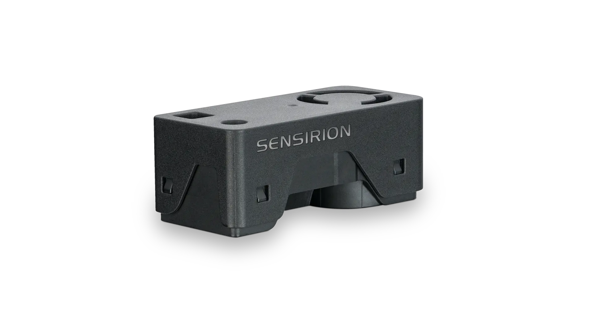

### What you will need

- A Mac computer as the development workstation
- Espressif ESP32-C6-DEVKITC-1-N8 Dev Kit board
- Sensirion SEN66 air quality 

## Install prerequisites

Before installing the Espressif development tools some prerequsites needs to be installed on MacOS.

### Homebrew package manager

If you haven't already installed the Homebrew package manager, you can install it by following the instructions found on the Homebrew web site https://brew.sh.

When you install Homebrew, it prints some directions for updating your shell’s config. If you don’t follow those directions, Homebrew will not work.

### Python

Espressif ESP-IDF uses the version of Python installed by default on macOS.

You can check what version of Python you have installed by issuing this command:

```
python3 --version
```

### Install packages

```
brew install cmake ninja dfu-util
```

### Install Visual Studio Code

Visit https://code.visualstudio.com/download and follow the instructions to download and install Visual Studio Code.

### Install ESP-IDF

Click on the Extensions icon in Visual Studio Code and search for "Espressif". Select the "ESP-IDF" extension and install it.

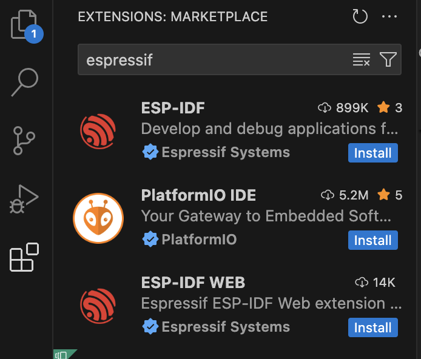

After installing the ESP-IDF extension you need to configure it.

Select "Configure ESP-IDF Extension":

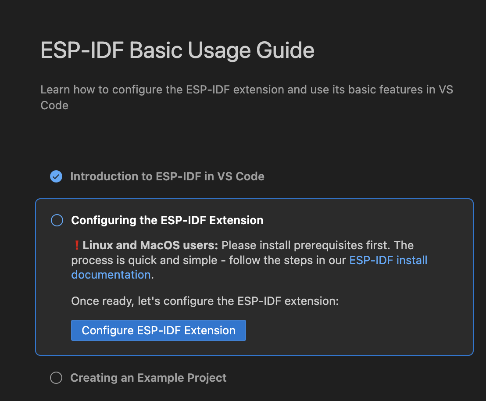

Select the Express Setup Mode

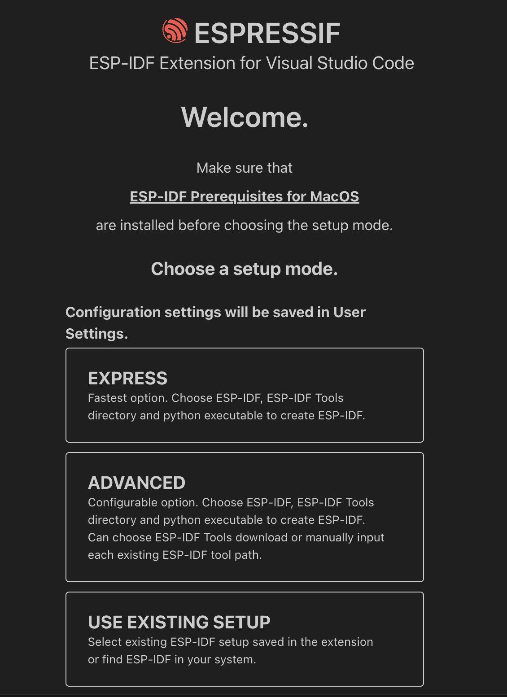

Select the latest version of ESP-IDF and click "Install":

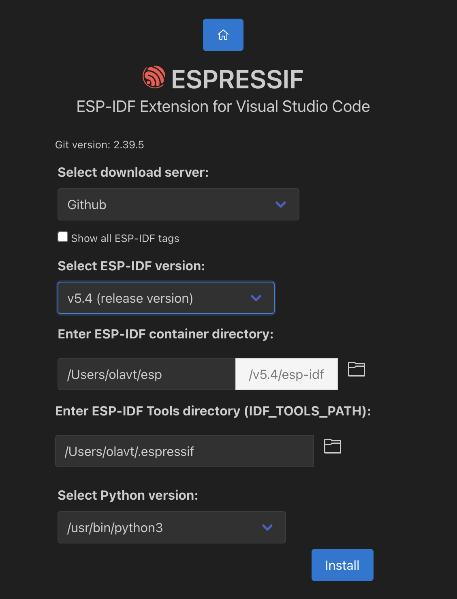

Select the Espressif ESP-IDF extension in the Visual Studio Code menu, expand the Advanced section and select "Install ESP-Matter":

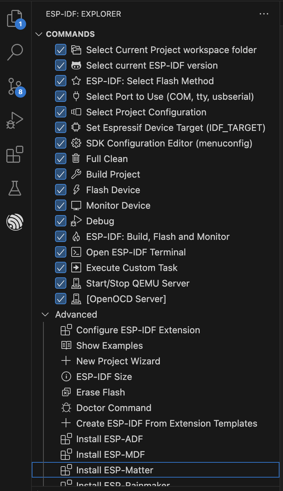

Select the default options.

## Create a new project based on the light example

Click on "Show examples".

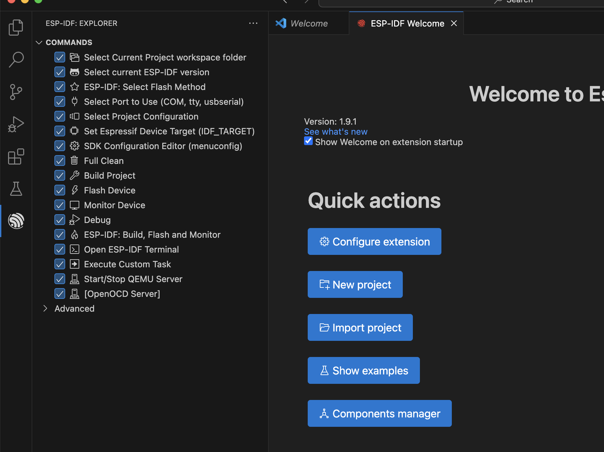

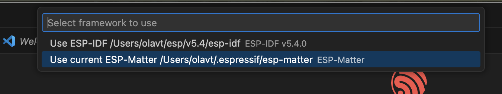

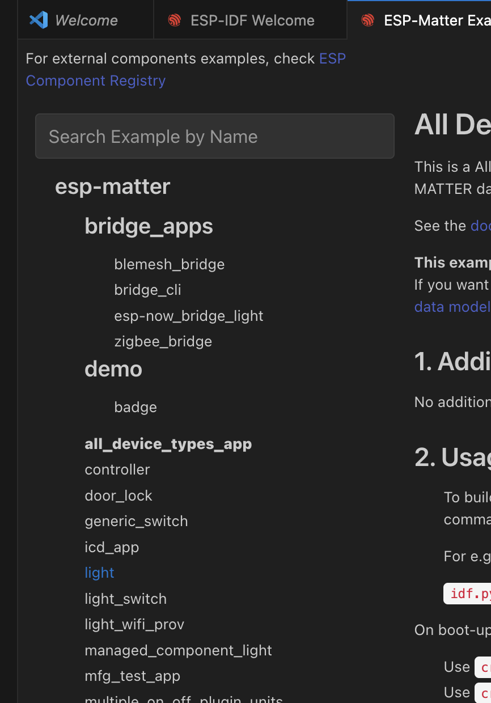

Click on the "light" example in the list.

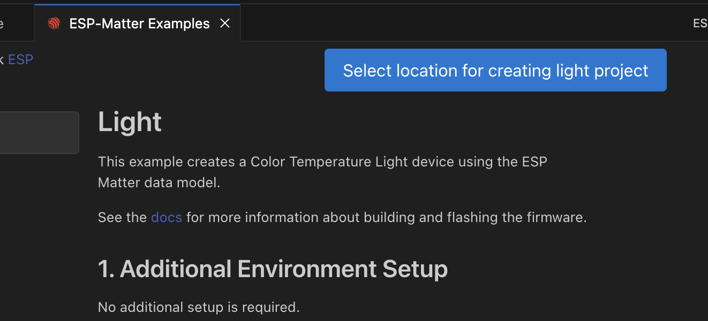

## Select Port To Use

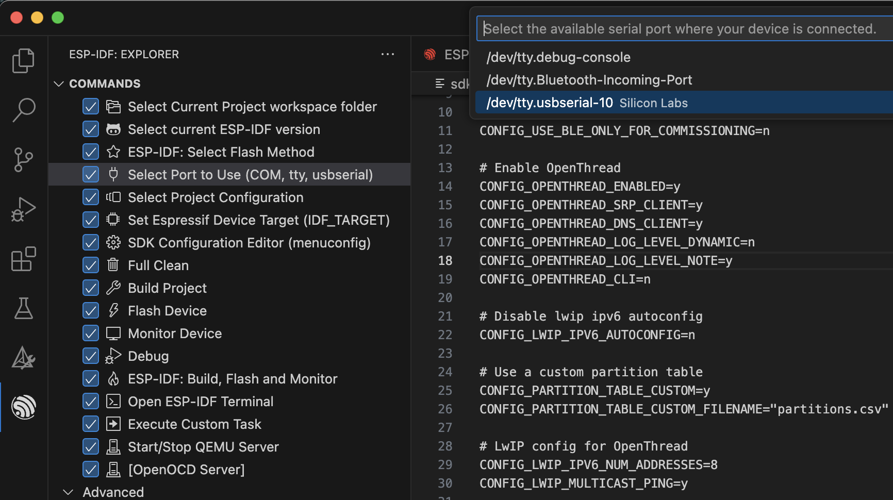

## Set Expressif Device Target

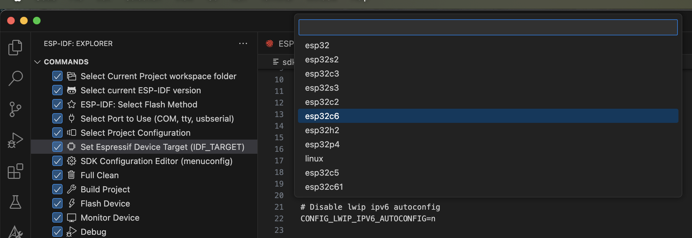

## Change settings from WiFi to Thread

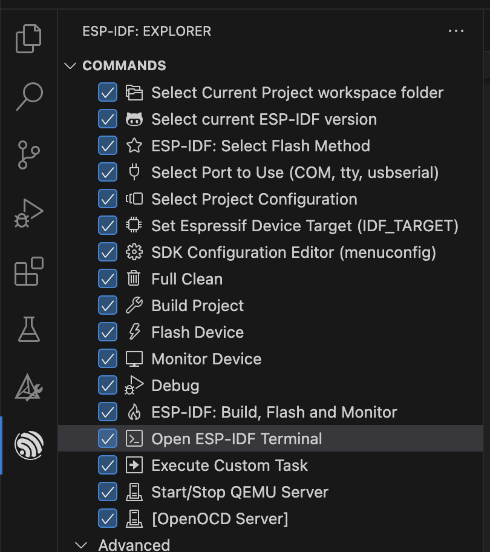

```
idf.py -D SDKCONFIG_DEFAULTS="sdkconfig.defaults.c6_thread" set-target esp32c6
```
