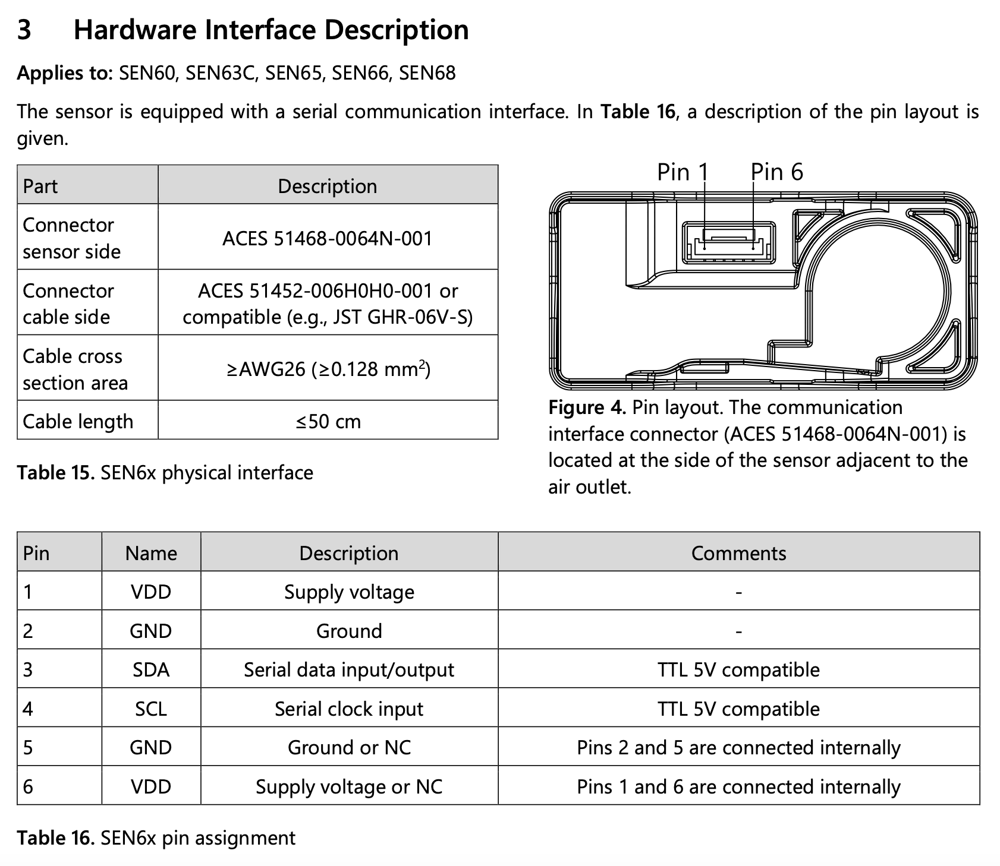

# Building a Matter over Thread Accessory Device based on the Espressif ESP32-C6-DEVKITC-1-N8 Dev Kit board
### Author: [Olav Tollefsen](https://www.linkedin.com/in/olavtollefsen/)

## Introduction

This article shows how to build a Matter Air Quality sensor with an ESP32-C6-DEVKITC-1-N8 Dev Kit board and a Sensirion SEN66 air quality sensor. The Sensirion SEN66 sensor connects to the ESP32 using I2C and supports measuring Particulate Matter (PM1, PM2.5, PM4, PM10), Relative Humidity, Temperature, Volatile Organic Compound, NOx (nitrogen oxides) and CO2.


### What you will need

- A Mac computer as the development workstation
- Espressif ESP32-C6-DEVKITC-1-N8 Dev Kit board
- Sensirion SEN66 air quality sensor

## Install prerequisites

Before installing the Espressif development tools some prerequsites needs to be installed on MacOS.

### Homebrew package manager

If you haven't already installed the Homebrew package manager, you can install it by following the instructions found on the Homebrew web site https://brew.sh.

When you install Homebrew, it prints some directions for updating your shell’s config. If you don’t follow those directions, Homebrew will not work.

### Python

Espressif ESP-IDF uses the version of Python installed by default on macOS.

You can check what version of Python you have installed by issuing this command:

```
python3 --version
```

### Install packages

```
brew install cmake ninja dfu-util
```

### Install Visual Studio Code

Visit https://code.visualstudio.com/download and follow the instructions to download and install Visual Studio Code.

### Install ESP-IDF

The documentation for the ESP-IDF Extension for Visual Studio Code can be found here:

https://docs.espressif.com/projects/vscode-esp-idf-extension/en/latest/

Click on the Extensions icon in Visual Studio Code and search for "Espressif". Select the "ESP-IDF" extension and install it.


After installing the ESP-IDF extension you need to configure it.

Select "Configure ESP-IDF Extension":


Select the Express Setup Mode


Select the latest version of ESP-IDF and click "Install":


### Install ESP-Matter

Note! Make sure you have an folder open in Visual Studio Code before installing ESP-Matter. Otherwise the installation will fail with an error about a missing workspace.

Select the Espressif ESP-IDF extension in the Visual Studio Code menu, expand the Advanced section and select "Install ESP-Matter":


Select the default options.

## Create a new project based on the light example

Click on "Show examples".


Select the ESP-Matter Framework.


Click on the "light" example in the list of example applications.


Click "Select location for creating light project":


## Select Flash Method


## Select Port To Use


## Set Expressif Device Target


## Configure OpenOCD (for debugging)

Select this menu choice from Visual Studio Code:

View->Command Palette

Select the "ESP-IDF: Select OpenOCD Board Configuration":


Note! To use the JTAG debugging connect the USB-C cable to the right USB-port on the ESP32-C6 dev kit.

## Change settings from WiFi to Thread

Create a new text file named "sdkconfig.defaults.c6_thread"

Add the following content:

```
CONFIG_IDF_TARGET="esp32c6"

# libsodium
CONFIG_LIBSODIUM_USE_MBEDTLS_SHA=y

# NIMBLE
CONFIG_BT_ENABLED=y
CONFIG_BT_NIMBLE_ENABLED=y
CONFIG_BT_NIMBLE_EXT_ADV=n
CONFIG_BT_NIMBLE_HCI_EVT_BUF_SIZE=70
CONFIG_USE_BLE_ONLY_FOR_COMMISSIONING=n

# Enable OpenThread
CONFIG_OPENTHREAD_ENABLED=y
CONFIG_OPENTHREAD_SRP_CLIENT=y
CONFIG_OPENTHREAD_DNS_CLIENT=y
CONFIG_OPENTHREAD_LOG_LEVEL_DYNAMIC=n
CONFIG_OPENTHREAD_LOG_LEVEL_NOTE=y
CONFIG_OPENTHREAD_CLI=n

# Disable lwip ipv6 autoconfig
CONFIG_LWIP_IPV6_AUTOCONFIG=n

# LwIP config for OpenThread
CONFIG_LWIP_IPV6_NUM_ADDRESSES=8
CONFIG_LWIP_MULTICAST_PING=y

# MDNS platform
CONFIG_USE_MINIMAL_MDNS=n
CONFIG_ENABLE_EXTENDED_DISCOVERY=y

# Disable STA for ESP32C6
CONFIG_ENABLE_WIFI_STATION=n
```


```
CONFIG_ESPTOOLPY_FLASHSIZE_4MB=y
```

```
idf.py -D SDKCONFIG_DEFAULTS="sdkconfig.defaults.c6_thread" set-target esp32c6
```

## Connect the hardware



The recommended voltage is 3.3V.


## Connecting the SEN66 sensor

- Connecting the SEN66 air quality sensor

| ESP32-C6 Pin | SEN66 Pin |
|--------------|-----------|
| GND          | GND       |
| 3V3          | VCC       |
| GPIO 6       | SDA       |
| GPIO 7       | SCL       |

## Add configuration for the SEN66 I2C pin configuration

Create a new text file named "Kconfig.projbuild" under the main directory.

Create a new text file named "sdkconfig.defaults.c6_thread"

Add the following content:

```
menu "SEN66 I2C Configuration"

    config SEN66_I2C_SDA_PIN
        int "I2C SDA Pin"
        default 6
        help
            GPIO number for I2C master data

    config SEN66_I2C_SCL_PIN
        int "I2C SCL Pin"
        default 7
        help
            GPIO number for I2C master clock

endmenu
```

Save the file.

The values can now be edited with by using the Kconfig editor:

```
idf.py menuconfig
```

## Copy SEN66 I2C driver source files into your project

You will find I2C driver source files in this Github repo:

https://github.com/Sensirion/embedded-i2c-sen66

Create a new directory under "main" named "drivers".

Update the "CMakeLists.txt" file to include the "drivers" subdirectory like this:

```
idf_component_register(SRC_DIRS          "." "drivers"
                       PRIV_INCLUDE_DIRS  "." "drivers" "${ESP_MATTER_PATH}/examples/common/utils")
```

Copy the .h and .c source files to your projects main/drivers directory.

Replace the content of the sensirion_i2c_hal.c source file with this code:

```
#include "sensirion_i2c_hal.h"
#include "sensirion_common.h"
#include "sensirion_config.h"

#include <esp_log.h>
#include <driver/i2c.h>
#include "sdkconfig.h"

/*
 * INSTRUCTIONS
 * ============
 *
 * Implement all functions where they are marked as IMPLEMENT.
 * Follow the function specification in the comments.
 */

 static const char * TAG = "SEN66";

#define I2C_MASTER_SCL_IO CONFIG_SEN66_I2C_SCL_PIN
#define I2C_MASTER_SDA_IO CONFIG_SEN66_I2C_SDA_PIN
#define I2C_MASTER_NUM I2C_NUM_0    /*!< I2C port number for master dev */
#define I2C_MASTER_FREQ_HZ 100000   /*!< I2C master clock frequency */

/**
 * Select the current i2c bus by index.
 * All following i2c operations will be directed at that bus.
 *
 * THE IMPLEMENTATION IS OPTIONAL ON SINGLE-BUS SETUPS (all sensors on the same
 * bus)
 *
 * @param bus_idx   Bus index to select
 * @returns         0 on success, an error code otherwise
 */
int16_t sensirion_i2c_hal_select_bus(uint8_t bus_idx) {
    /* TODO:IMPLEMENT or leave empty if all sensors are located on one single
     * bus
     */
    return NOT_IMPLEMENTED_ERROR;
}

/**
 * Initialize all hard- and software components that are needed for the I2C
 * communication.
 */
void sensirion_i2c_hal_init(void) {

    i2c_config_t i2c_conf = {
        .mode = I2C_MODE_MASTER,
        .sda_io_num = I2C_MASTER_SDA_IO,
        .scl_io_num = I2C_MASTER_SCL_IO,
        .sda_pullup_en = GPIO_PULLUP_ENABLE,
        .scl_pullup_en = GPIO_PULLUP_ENABLE,
        .master = {
            .clk_speed = I2C_MASTER_FREQ_HZ,
        },
    };

    esp_err_t err = i2c_param_config(I2C_MASTER_NUM, &i2c_conf);
    if (err != ESP_OK) {
        ESP_LOGE(TAG, "Failed to configure I2C driver, err:%d", err);
        return;
    }

    err = i2c_driver_install(I2C_MASTER_NUM, I2C_MODE_MASTER, 0, 0, 0);

    return;
}

/**
 * Release all resources initialized by sensirion_i2c_hal_init().
 */
void sensirion_i2c_hal_free(void) {
    /* TODO:IMPLEMENT or leave empty if no resources need to be freed */
}

/**
 * Execute one read transaction on the I2C bus, reading a given number of bytes.
 * If the device does not acknowledge the read command, an error shall be
 * returned.
 *
 * @param address 7-bit I2C address to read from
 * @param data    pointer to the buffer where the data is to be stored
 * @param count   number of bytes to read from I2C and store in the buffer
 * @returns 0 on success, error code otherwise
 */
int8_t sensirion_i2c_hal_read(uint8_t address, uint8_t* data, uint8_t count) {

    i2c_cmd_handle_t cmd = i2c_cmd_link_create();
    i2c_master_start(cmd);
    i2c_master_write_byte(cmd, (address << 1) | I2C_MASTER_READ, true /* enable_ack */);
    i2c_master_read(cmd, data, count, I2C_MASTER_LAST_NACK);
    i2c_master_stop(cmd);
    i2c_master_cmd_begin(I2C_MASTER_NUM, cmd, pdMS_TO_TICKS(1000));
    i2c_cmd_link_delete(cmd);
    cmd = NULL;

    return ESP_OK;
}

/**
 * Execute one write transaction on the I2C bus, sending a given number of
 * bytes. The bytes in the supplied buffer must be sent to the given address. If
 * the slave device does not acknowledge any of the bytes, an error shall be
 * returned.
 *
 * @param address 7-bit I2C address to write to
 * @param data    pointer to the buffer containing the data to write
 * @param count   number of bytes to read from the buffer and send over I2C
 * @returns 0 on success, error code otherwise
 */
int8_t sensirion_i2c_hal_write(uint8_t address, const uint8_t* data, uint8_t count)
{
    i2c_cmd_handle_t cmd = i2c_cmd_link_create();
    i2c_master_start(cmd);
    i2c_master_write_byte(cmd, (address << 1) | I2C_MASTER_WRITE, true /* enable_ack */);
    // Read temperature first then humidity, with clock stretching enabled
    i2c_master_write(cmd, data, count, true);
    i2c_master_stop(cmd);
    i2c_master_cmd_begin(I2C_MASTER_NUM, cmd, pdMS_TO_TICKS(1000));
    i2c_cmd_link_delete(cmd);
    cmd = NULL;

    return ESP_OK;
}

/**
 * Sleep for a given number of microseconds. The function should delay the
 * execution for at least the given time, but may also sleep longer.
 *
 * Despite the unit, a <10 millisecond precision is sufficient.
 *
 * @param useconds the sleep time in microseconds
 */
void sensirion_i2c_hal_sleep_usec(uint32_t useconds) {
    esp_rom_delay_us(useconds);
}

```

## Add Code for Air Quaility Sensor

```
    // Create Air Quality Endpoint
    air_quality_sensor::config_t air_quality_config;
    endpoint_t *air_quality_endpoint = air_quality_sensor::create(node, &air_quality_config, ENDPOINT_FLAG_NONE, NULL);
    ABORT_APP_ON_FAILURE(air_quality_endpoint != nullptr, ESP_LOGE(TAG, "Failed to create air quality sensor endpoint"));
```